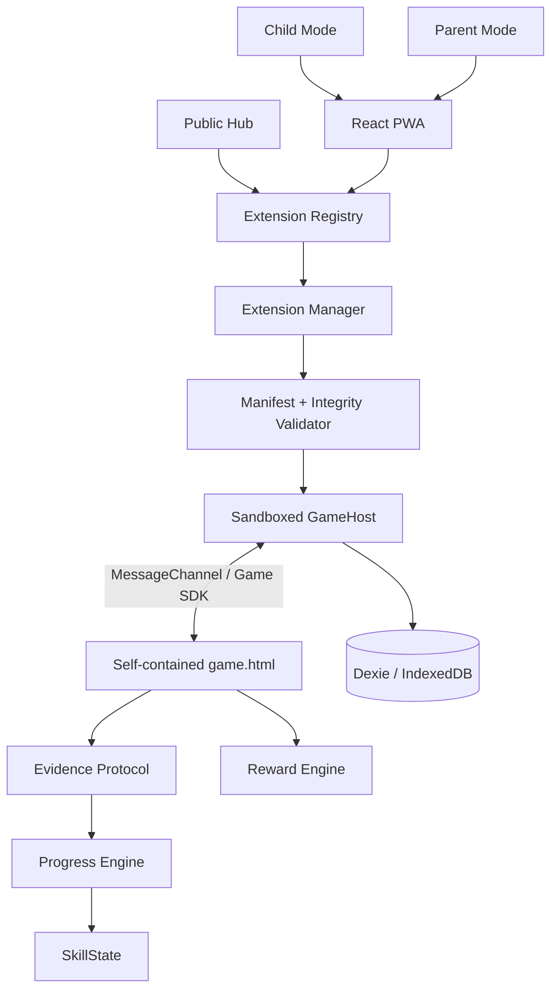

# Arquitetura do Aprincar

## Visão geral

O Aprincar é uma plataforma web/PWA local-first para experiências de aprendizagem lúdica. O App e o Hub são aplicações React separadas. Os jogos são bundles independentes executados em um host sandboxado.



## Limites de responsabilidade

### App e Hub

O App controla navegação, perfis, biblioteca, preparação offline, Parent Mode e apresentação do produto. O Hub oferece descoberta pública e não deve acessar dados privados do App.

### GameHost

O GameHost carrega o artefato em iframe sandboxado, injeta a política de conteúdo e estabelece o `MessageChannel`. O jogo não recebe acesso ao DOM pai, ao IndexedDB do App, ao PIN responsável ou a outros jogos.

### Game SDK

O SDK oferece somente operações aprovadas pelo contrato: ciclo de sessão, evidência, recompensas, armazenamento isolado e capabilities com permissão explícita.

### Dados pedagógicos

```text
Game → Evidence → Progress Engine → SkillState
Game → Reward Engine → estrelas/medalhas
Skill → Curriculum Mapping → BNCC
```

Um jogo não escreve `SkillState` e não referencia BNCC diretamente.

## Modelo local-first

O IndexedDB é a fonte de verdade local. A biblioteca identifica uma intenção do perfil; a disponibilidade offline é uma propriedade separada obtida ao preparar o artefato. O service worker armazena o shell da PWA, e o Extension Manager armazena jogos preparados com integridade verificada.

## Decisões importantes

- Código da plataforma: AGPL-3.0-only.
- Artefatos de jogos: `single-html` para V1.
- Integridade: SHA-256 do `game.html` no registry.
- Comunicação: mensagens protocoladas, sem acesso direto entre jogo e host.
- Permissões sensíveis: negadas por padrão e declaradas no manifesto.
