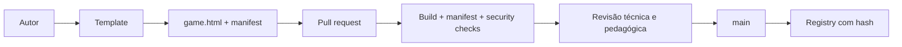

# Extensões e jogos

## Artefato mínimo

Uma extensão V1 publicada contém:

```text
games/<publisher>/<slug>/
├── manifest.json
├── game.html
└── README.md
```

`game.html` deve ser autocontido. Código remoto, CDN, chamadas de rede desnecessárias e dependências não declaradas não são aceitos.

## Manifesto V1

O manifesto declara `manifestVersion`, identidade, versão, publisher, entrypoint, engines, permissões, habilidades, faixa etária, interesses, tipo de experiência e suporte offline. O schema canônico está em `platform/schemas/extension-manifest-v1.schema.json` e também em `games-official/schemas/`.

As habilidades declaradas precisam existir no Skill Graph. O jogo pode emitir somente habilidades declaradas no manifesto.

## Criar um jogo

1. Escolha o template conforme a tecnologia.
2. Instale dependências e execute o `check` do template.
3. Preencha `manifest.json` sem inventar Skill IDs ou cobertura BNCC.
4. Gere um `game.html` único com o SDK.
5. Verifique teclado, mouse, touch, foco, feedback correto/incorreto e estados de erro.
6. Teste a resposta correta, avanço, reinício e persistência relevante.
7. Rode validação, auditoria e inspeção manual.
8. Envie um PR no repositório apropriado.

## Fluxo de publicação



Jogos oficiais são gerados a partir de `games-official/src/`. Não edite manualmente os HTML gerados. Jogos comunitários entram em `community-games/games/` e nunca recebem privilégios extras por serem aprovados.
