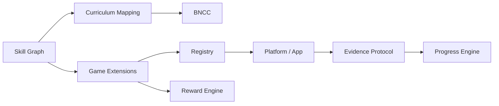

# Mapa dos projetos

| Repositório                                                                  | Responsabilidade                                                                       | Alterações típicas                          |
| ---------------------------------------------------------------------------- | -------------------------------------------------------------------------------------- | ------------------------------------------- |
| [`platform`](https://github.com/aprincar/platform)                           | App PWA, Hub, contratos, GameHost, SDK, armazenamento, Skill Graph, Progress e Rewards | Produto, plataforma e integrações           |
| [`games-official`](https://github.com/aprincar/games-official)               | Geradores, runtimes e catálogo oficial                                                 | Jogos oficiais e regras de desafio          |
| [`community-games`](https://github.com/aprincar/community-games)             | Pacotes enviados pela comunidade                                                       | Inclusão e manutenção de jogos comunitários |
| [`curriculum-bncc`](https://github.com/aprincar/curriculum-bncc)             | Mapeamento Skill → currículo → BNCC                                                    | Mapeamentos com fonte e revisão pedagógica  |
| [`game-template-vite`](https://github.com/aprincar/game-template-vite)       | Template mínimo                                                                        | Jogos HTML simples                          |
| [`game-template-react`](https://github.com/aprincar/game-template-react)     | Template React                                                                         | Jogos com componentes React                 |
| [`game-template-phaser`](https://github.com/aprincar/game-template-phaser)   | Template Phaser                                                                        | Jogos 2D interativos                        |
| [`game-template-threejs`](https://github.com/aprincar/game-template-threejs) | Template Three.js                                                                      | Experiências 3D                             |
| [`.github`](https://github.com/aprincar/.github)                             | Perfil e políticas da organização                                                      | Governança, templates e documentação        |

## Onde colocar uma mudança?

- Tela, fluxo de perfil, biblioteca, Parent Mode, PWA ou host: `platform`.
- Gerador procedural, runtime ou jogo mantido pelo Aprincar: `games-official`.
- Jogo externo ou contribuição da comunidade: `community-games`.
- Nova habilidade ou relação curricular: `platform` para Skill Graph e `curriculum-bncc` para o crosswalk, com revisão pedagógica.
- Novo ponto de partida para autores: template correspondente.
- Política, segurança, suporte ou padrão de PR: `.github`.

## Ordem conceitual de dependência

O diagrama representa responsabilidades, não importações diretas entre repositórios. O App consome artefatos de extensão por registry.
