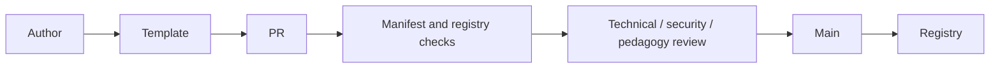

# Community publication workflow

Do not edit the generated registry by hand. The registry is rebuilt from accepted game directories. Community games must not access App IndexedDB, profile data, parent controls or another extension.

