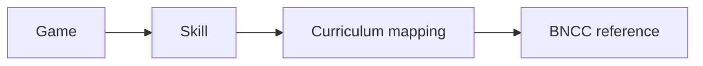

# Curriculum and BNCC documentation

This repository is a conservative crosswalk from Aprincar Skill IDs to BNCC references.

## Integrity boundary

Games do not reference BNCC directly. A mapping describes a relationship; it does not claim school mastery or replace formal assessment.

## Validation

Run `npm install` and `npm run check`. The validator checks Skill IDs, BNCC references, relation types and referential integrity. New mappings require pedagogical review and a cited source.

