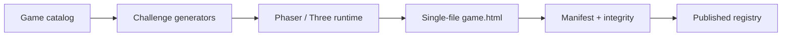

# Official games architecture

Generators own answer semantics. Renderers receive a validated challenge and report interaction through the SDK bridge. Official games run without remote code or network dependencies.

