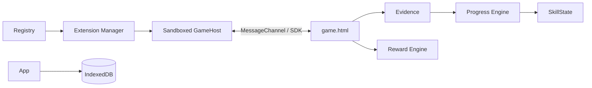

# Aprincar Platform documentation

## Scope

The platform repository contains the React + TypeScript + Vite PWA, the standalone Hub and the shared packages that implement the extension boundary.

## Domain map

| Domain     | Location                       | Responsibility                                                        |
| ---------- | ------------------------------ | --------------------------------------------------------------------- |
| App        | `apps/app`                     | onboarding, profiles, Child Mode, library, parent mode and play route |
| Hub        | `apps/hub`                     | independent public catalog for extensions                             |
| Contracts  | `packages/extension-contracts` | GameManifest v1 and validation                                        |
| Host       | `packages/extension-host`      | sandboxed iframe and MessageChannel                                   |
| SDK        | `packages/extension-sdk`       | game-to-host protocol                                                 |
| Registry   | `packages/extension-registry`  | registry and integrity resolution                                     |
| Progress   | `packages/progress-engine`     | Evidence to SkillState                                                |
| Rewards    | `packages/reward-engine`       | stars and medals, isolated from mastery                               |
| Storage    | `packages/storage`             | Dexie/IndexedDB persistence boundary                                  |
| Skills     | `packages/skill-graph`         | skill definitions and relationships                                   |
| Curriculum | `packages/curriculum`          | optional Skill-to-BNCC crosswalk                                      |

## Data flow

A game never imports App source, reads parent data, or writes SkillState directly.
